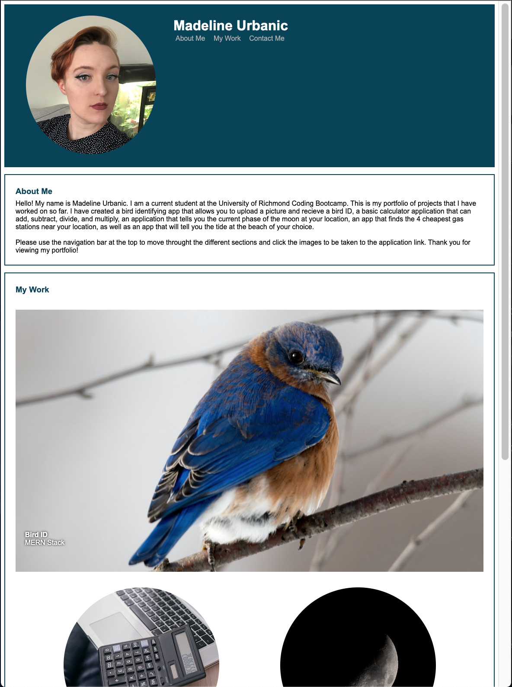

# 2-Portfolio-Web

## Description

This project is a personal portfolio of the projects and assignments I create through the bootcamp. This webpage contains a profile picture and contact information, the project link sections will lead to blank webpages initially and will be updated as I progress through the course.

This is showcasing my understanding of HTML and CSS in order to make a basic webpage.

All code outside sources and code utalized are linked below in the "Credits" section. Each image used other than my profile picture (which is taken and owned by myself) is also linked in the credits section. Because I do not have projects to display yet, clicking on each project image will take the user to the source of the image used.

## Installation

This project can be downloaded (as a whole) and ran in Visual Studio Code with no additional modifications.

## Usage

https://m-r-urbanic.github.io/2-Portfolio-Web/

After opening the page in your browser, you can use the "About Me", "My Work", and "Contact Me" buttons in the navegation bar to go to each section. If you click any of the items in the "My Work" section, you will be taken to the source image for that item.

The webpage will adjust as the screen size changes.

## Credits

Please see links to all code referanced or used and images used below. The header image and all images used to test belong to me.

Unordered list not aligning all the way to the left in a div, Stack Overflow, https://stackoverflow.com/questions/10972096/unordered-list-not-aligning-all-the-way-to-the-left-in-a-div

CSS: Flexbox within Flexbox, Stack Overflow, https://stackoverflow.com/questions/40862933/css-flexbox-within-flexbox

Basic concepts of flexbox, mdn web docs, https://developer.mozilla.org/en-US/docs/Web/CSS/CSS_flexible_box_layout/Basic_concepts_of_flexbox

Adding space between flexbox items, Stack Overflow, https://stackoverflow.com/questions/49329905/adding-space-between-flexbox-items

How to vertically Align a Text Next to the Image, w3 docs, https://www.w3docs.com/snippets/css/how-to-vertically-align-text-next-to-an-image.html

How To Embed A Hyperlink In An Image, HYPERRISE, https://hyperise.com/blog/how-to-embed-a-hyperlink-in-an-image#:~:text=Put%20the%20anchor%20tag%20%3Ca,http%3A%2F%2F%E2%80%9D%20before%20the%20link.

HTML Semantic Elements, W3Schools, https://www.w3schools.com/html/html5_semantic_elements.asp

CSS Styling Images, W3Schools, https://www.w3schools.com/css/css3_images.asp

Center text over an image in flexbox, Stack Overflow, https://stackoverflow.com/questions/35871294/center-text-over-an-image-in-flexbox

Photo by Mikhail Nilov: https://www.pexels.com/photo/a-laptop-and-calculator-on-a-wooden-table-6963055/

Photo by Tina Nord: https://www.pexels.com/photo/photography-of-small-blue-and-brown-bird-792416/

Photo by Jose Cruz Y Corro: https://www.pexels.com/photo/waxing-moon-crescent-in-black-night-sky-18051705/

Photo by Josh Sorenson: https://www.pexels.com/photo/body-of-water-beside-beach-sand-386148/

Photo by Elina Sazonova: https://www.pexels.com/photo/person-holding-map-inside-vehicle-2705756/

## License

MIT Liscense